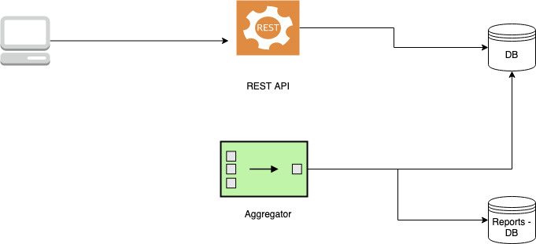
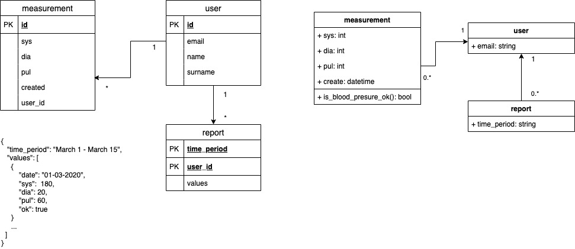

# AHM Python

AHM is a shortcut for  *Application for hypertension monitoring*. Yes, I know, it is not the best name, but I like it.

The backend for this project was written in Python, there is another variant for AHM I'm planning to implement in Golang, the repository will be located in:

* https://github.com/jorlugaqui/ahm

And actually, I wrote about it in:

* https://medium.com/swlh/deploying-a-go-function-on-google-cloud-platform-9b79dd9d99aa

I have also recorded a workshop in which I have explained and shown the implementation's details for this Python variant. You could find it in:

* https://ed.team/cursos/flask-js (Spanish only - Let me know if you are interested in an English version)

## Motivation

This application aims to serve as a measurement tracker for people who suffer high blood pressure issues, like me.

## Architecture

The application follows a monolithic - single repository approach, with a three-tier architecture (data-logic-client).



There are four components in this application:

* api: The *api* component exposes a REST API which allows users to add and query blood pressure's measurements.

* aggregator: The *aggregator* lives within the API component and it is a standalone Python script thought to be run as a cron. It moves the measurements to the reporting entity.

* client: The *client* (web folder) is an independent vue JS application, which offers a form and a report page. Independent here does not mean it is a microservice.

* db: A document-based database (mongoDB).

## DB design / Class model

There are three main entities that are related to each other as follow:



## REST API

The API exposes the following endpoints:

| HTTP METHOD | URI | Response |
|---|---|---|
| POST | /v1/measurement | 201 |
| PATCH | /v1/measurement/<id> | 200 |
| GET  | /v1/measurement/<id> | 200 |
| GET  | /v1/report/<time_period> | 200 |

### Examples:

* `curl --location --request GET 'http://127.0.0.1:5000/v1/measurements/5ecbd76781201d2624f9583c'`

* `curl --location --request GET 'http://127.0.0.1:5000/v1/report/2020-05-31'`

* `curl --location --request POST 'http://127.0.0.1:5000/v1/measurements' \
--data-raw '{
	"dia": 30,
	"pul": 66,
	"sys": 77
}'`

* `curl --location --request PATCH 'http://127.0.0.1:5000/v1/measurements/5ed329d0502dbd286623fd77' \
--data-raw '{
	"sys": 1
}'`

## Business requirements

If you are curious, you can find the application's requirements in https://trello.com/b/SRSfqPB7/ahm.

## Running the application in local

The application can be run locally using docker-compose. If you check the docker-compose file you will notice that the services are mapped to the main components in the architecture:

* mongo: The *db* component
* api: The *api* component, which covers the aggregator.
* web: The *client* component, which is a vue JS app.

### Tech requirements

* Docker and docker-compose
* Git

### Creating your secrets

In order to have the containers up and running, a set of env variables needs to be defined. You can do so by creating a `.env` file and adding the following entries:

```
MONGO_INITDB_ROOT_USERNAME=root
MONGO_INITDB_ROOT_PASSWORD=root
API_ENV=development
API_HOST=0.0.0.0
API_APP=main.py
DB_NAME=ahm
DB_HOST=mongo
VUE_APP_API_HOST=http://localhost:5000
WEB_ENV=development
```

Keep in mind those values should be only used for local development.

### Running the database

`docker-compose up mongo`

You can also run a web UI interface (mongo-express) with:

`docker-compose up mongo-express`

Bear that the first time will take a while since it needs to download the images.

### Running the API

`docker-compose up api`

You may want to build the image first with:

`docker-compose build api`

### Running the client

The client requires a bit more patience for having it running in local with docker. First, let's build the image:

`docker-compose build web`

Second, let's install the requirements from a container

`docker-compose run web npm install`

Third, let's run the client:

`docker-compose up web`

## Running the application in production

This application is not ready for production. But it eventually will.

## Upcoming features

* Authentication
* More elaborated client
* Better error handling in the API
* Makefile for deployment
* Unit testing for the API
* Unit testing for the client
* Add CI/CD
